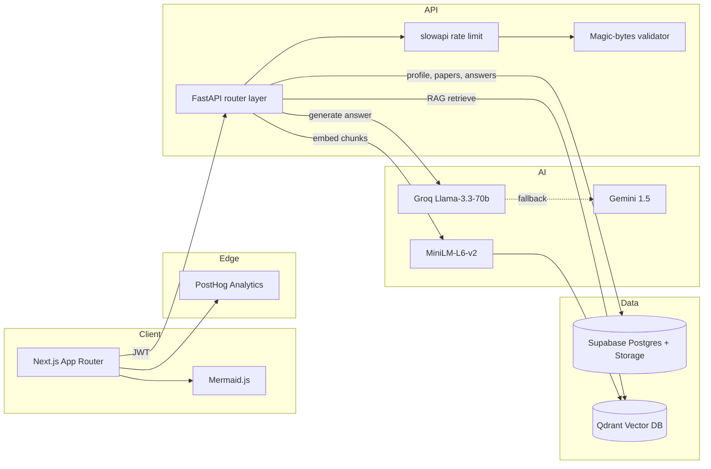

# GTU ExamAI

> AI-powered question prediction + RAG-grounded answer generation for **Gujarat Technological University** engineering students.

[](./LICENSE)
[](https://nextjs.org/)
[](https://fastapi.tiangolo.com/)
[](https://supabase.com/)
[](https://qdrant.tech/)
[](#)
[](./CONTRIBUTING.md)

---

## What is this

GTU runs ~70% repeated questions every year, but no tool actually surfaces *which* ones. Students grind 8 papers manually, miss the pattern, score average.

**GTU ExamAI** ingests past papers + syllabus PDFs, embeds them, then:

1. **Predicts** the most likely upcoming questions (Bayesian + recency + cycle-gap signals + LLM "professor" reranker).
2. **Generates** GTU-style answers grounded on uploaded study materials — with diagrams (Mermaid / Graphviz / ASCII), code blocks, and exam-format markdown.
3. **Chats** like a subject tutor (GTU GPT) — RAG context + streaming Gemini answers + suggested follow-ups.

End-to-end: upload PDFs → get a ranked predict list → tap any question → ready-to-write topper-style answer in seconds.

---

## Live demo

> Set your Vercel URL via `homepageUrl` on GitHub repo settings, or open a PR updating this section once deployed.

```
Frontend: <your-vercel-domain>
Backend:  <your-railway-domain>
```

---

## Features

| Module | What it does |
|---|---|
| **Predict (Brahmastra)** | Ranks past + likely-upcoming questions per subject. Tier-coded `Certain` / `Likely` / `Watch`. Bayesian Beta-Binomial scoring + recency decay + syllabus deficit. |
| **Answer Engine** | Question → RAG retrieval (Qdrant) → verb/mark-tier template → Groq Llama-3.3-70b primary, Gemini fallback. Streamed back as GTU-format markdown. |
| **GTU GPT (Chat)** | Multi-turn subject-aware chat. SSE streaming. Session history. Source citations. Auto-suggested follow-ups. |
| **Diagrams** | LLM emits Mermaid / Graphviz DSL → renders client-side (free, instant). Kroki for PDF export. ASCII fallback. |
| **Study Materials** | PDF upload → magic-bytes validated → smart chunking → 384-dim embeddings → Qdrant per-subject collection. |
| **Community (E2EE)** | Anonymous cross-semester doubt rooms. Web Crypto AES-GCM-256 keys derived from room code. Server stores ciphertext only. |
| **Admin** | Subject CRUD, paper queue + scrape, coins/streak controls, testimonials, news, coupons, manual feedback loop. |
| **Engagement** | Coin economy, daily streaks, leaderboards, DiceBear avatars. |

---

## Tech stack

**Frontend** — Next.js 14 (App Router) · TypeScript · Tailwind · Supabase Auth Helpers · react-markdown + remark-gfm · Mermaid.js · PostHog
**Backend** — FastAPI · Pydantic v2 · slowapi rate limiter · Sentry · GZip · Magic-bytes file validator
**Data** — Supabase Postgres (RLS) · Qdrant Cloud (vectors) · Supabase Storage (PDFs)
**AI** — Groq Llama-3.3-70b (primary) · Google Gemini (fallback + streaming chat) · `all-MiniLM-L6-v2` sentence-transformers
**Infra** — Vercel (frontend) · Railway (backend) · Kroki (diagram render)

---

## Architecture



---

## Quick start

### Prerequisites

- Node.js 20+
- Python 3.10+
- Supabase project (free tier)
- Qdrant Cloud cluster (free tier) **or** local `qdrant/qdrant` docker
- Groq API key — [console.groq.com](https://console.groq.com/)
- Google Gemini API key — [aistudio.google.com](https://aistudio.google.com/)

### 1. Clone + install

```bash
git clone https://github.com/YashB118/GTUAI-Backend.git GTU-ExamAI
cd GTU-ExamAI

# Backend
cd backend
python3 -m venv .venv && source .venv/bin/activate
pip install -r requirements.txt

# Frontend
cd ../frontend
npm install
```

### 2. Env

Copy `.env.example` → `.env` (backend) and `.env.example` → `frontend/.env.local`. Fill in:

```bash
# backend/.env
SUPABASE_URL=https://xxxx.supabase.co
SUPABASE_ANON_KEY=...
SUPABASE_SERVICE_KEY=...
JWT_SECRET=...
QDRANT_URL=https://your-cluster.qdrant.tech
QDRANT_API_KEY=...
GROQ_API_KEY=...
GEMINI_API_KEY=...

# frontend/.env.local
NEXT_PUBLIC_SUPABASE_URL=...
NEXT_PUBLIC_SUPABASE_ANON_KEY=...
NEXT_PUBLIC_BACKEND_URL=http://localhost:8000
NEXT_PUBLIC_SITE_URL=http://localhost:3000
NEXT_PUBLIC_POSTHOG_KEY=phc_xxx        # optional
```

### 3. DB migrations

Run SQL scripts in order via Supabase SQL Editor:

```
backend/scripts/phase5_indexes.sql
backend/scripts/community_migration.sql
backend/scripts/chat_tables.sql           # if present
backend/scripts/diagram_cache.sql         # if present
```

### 4. Run

```bash
# Terminal 1 — backend
cd backend && source .venv/bin/activate
uvicorn main:app --reload --port 8000

# Terminal 2 — frontend
cd frontend
npm run dev
```

Visit `http://localhost:3000`.

---

## API surface

All routes prefixed under FastAPI app:

| Path | Purpose |
|---|---|
| `POST /auth/register` | New student account |
| `POST /papers/upload` | Past paper PDF → background process |
| `POST /materials/upload` | Study material PDF → chunk + embed |
| `GET  /predictions/{subject_id}` | Ranked prediction list (cached 3 days) |
| `POST /answers/generate` | RAG + LLM answer for a question |
| `POST /chat/message` | Streamed (SSE) chat turn |
| `GET  /oracle/share/{share_id}` | Public brief, no auth |
| `GET  /diagrams/detect-type` | Decide diagram engine for a question |
| `POST /diagrams/generate` | Mermaid / Graphviz / ASCII DSL |
| `POST /community/rooms` | Create anon E2EE room |
| `WS   /community/ws/{room_id}` | Real-time room socket |

Swagger UI auto-served at `http://localhost:8000/docs`.

---

## Project structure

```
.
├── backend/                 FastAPI app
│   ├── routers/             REST + WS endpoints
│   ├── services/            answer_engine, chat_engine, prediction_engine, diagram_engine, ws_manager, ...
│   ├── workers/             background tasks
│   ├── middleware/          auth, rate limiter
│   └── scripts/             SQL migrations, GTU paper scraper
├── frontend/                Next.js 14 app router
│   ├── app/
│   │   ├── (auth)/          login, register
│   │   ├── (student)/       dashboard, predict, brahmastra, chat, community, materials, ...
│   │   ├── (admin)/         admin dashboard
│   │   ├── robots.ts        SEO
│   │   └── sitemap.ts       SEO
│   ├── components/          UI + landing + chat + community + diagrams
│   ├── hooks/               useChatStream, useCommunitySocket
│   └── lib/                 supabase, crypto, posthog, api wrapper
├── DAILY.md                 30-day growth backlog
├── AI_IMPROVEMENT_PLAN.md   research-backed AI quality roadmap
└── docs/                    longer-form docs
```

---

## Roadmap

Live daily log: **[DAILY.md](./DAILY.md)** — one feature branch per day, 30-day growth + virality push.

Higher-effort AI quality work tracked in **[AI_IMPROVEMENT_PLAN.md](./AI_IMPROVEMENT_PLAN.md)** — verb-template router, MMR retrieval, recency weighting, hybrid BM25 + Qdrant, syllabus mapping.

---

## Contributing

Pull requests welcome — start with **[CONTRIBUTING.md](./CONTRIBUTING.md)**. Good first issues are labelled `good first issue`. For larger changes, open a discussion first.

---

## License

[MIT](./LICENSE) © 2026 Yash B

---

## Acknowledgements

Built on the shoulders of: **Supabase**, **Qdrant**, **Groq**, **Google Gemini**, **Vercel**, **FastAPI**, **Next.js**, **Mermaid**, **Kroki**, **sentence-transformers**.
